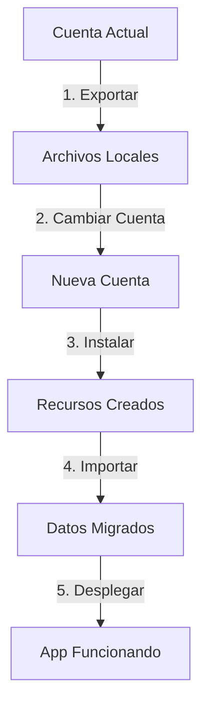

# 🚀 Sistema de Migración Cloudflare - ACA Chile

Sistema completo para migrar el proyecto ACA Chile entre cuentas de Cloudflare.

## 📦 ¿Qué incluye?

- ✅ Exportación completa de D1 Database (estructura + datos)
- ✅ Migración de R2 Bucket (imágenes)
- ✅ Configuración de KV Namespace
- ✅ Setup de Cloudflare Pages
- ✅ Variables de entorno y secrets
- ✅ Scripts automatizados paso a paso

## 🎯 Inicio Rápido

### Opción 1: Migración Interactiva (Recomendada)

```bash
./quick-migration.sh
```

Este script te guiará paso a paso con un menú interactivo.

### Opción 2: Migración Manual

```bash
# 1. Exportar desde cuenta actual
./migration-installer.sh

# 2. Exportar datos detallados (opcional)
./export-database-complete.sh

# 3. Cambiar a cuenta nueva
wrangler logout
wrangler login

# 4. Instalar en cuenta nueva
cd cloudflare-export
./install-in-new-account.sh
```

## 📋 Scripts Disponibles

### `quick-migration.sh` 
**Menú interactivo completo** con todas las opciones de migración paso a paso.

Funciones:
- ✅ Verificar cuentas
- ✅ Exportar recursos
- ✅ Cambiar cuenta
- ✅ Instalar en nueva cuenta
- ✅ Importar datos
- ✅ Migrar imágenes
- ✅ Configurar secrets
- ✅ Desplegar aplicación
- ✅ Verificar instalación

### `migration-installer.sh`
**Exportación completa** desde la cuenta actual.

Exporta:
- D1 Database (esquema y datos)
- R2 Bucket (inventario)
- KV Namespace (configuración)
- Archivos de configuración
- Genera scripts de instalación

### `export-database-complete.sh`
**Exportación detallada de base de datos** con SQL dumps.

Genera:
- JSON completo de cada tabla
- SQL INSERT statements
- Esquema completo
- Scripts de importación

## 🔄 Proceso de Migración



### Pasos Detallados

1. **Verificar Cuenta Actual**
   ```bash
   wrangler whoami
   ```

2. **Exportar Todo**
   ```bash
   ./migration-installer.sh
   ```

3. **Cambiar a Nueva Cuenta**
   ```bash
   wrangler logout && wrangler login
   ```

4. **Instalar en Nueva Cuenta**
   ```bash
   cd cloudflare-export
   ./install-in-new-account.sh
   ```

5. **Importar Datos**
   ```bash
   # Automático si hay SQL dumps
   for f in database/sql-dumps/*.sql; do
       wrangler d1 execute acachile-db --remote --file="$f"
   done
   ```

6. **Migrar Imágenes** (requiere Rclone)
   ```bash
   rclone sync cloudflare-old:aca-chile-images cloudflare-new:aca-chile-images -P
   ```

7. **Configurar Secrets**
   ```bash
   cd frontend
   wrangler pages secret put RESEND_API_KEY --project-name=acachile
   wrangler pages secret put GOOGLE_MAPS_API_KEY --project-name=acachile
   ```

8. **Desplegar**
   ```bash
   npm run build && npm run deploy
   ```

## ⚙️ Requisitos Previos

### Software Necesario

- [x] **Node.js** (v18 o superior)
- [x] **npm** o **pnpm**
- [x] **Wrangler CLI** (`npm install -g wrangler`)
- [ ] **Rclone** (para migración R2) - `brew install rclone`
- [ ] **jq** (para procesar JSON) - `brew install jq`

### Información Requerida

Antes de comenzar, ten a mano:

1. **API Keys**:
   - `RESEND_API_KEY`
   - `GOOGLE_MAPS_API_KEY`

2. **Acceso a ambas cuentas**:
   - Cuenta actual (origen)
   - Cuenta nueva (destino)

## 📁 Estructura de Archivos Generados

```
cloudflare-export/
├── migration-config.json          # Configuración del proyecto
├── install-in-new-account.sh      # Instalador para cuenta nueva
├── import-database-data.sh        # Importador de datos
├── migrate-r2-images.sh           # Migrador de imágenes
├── NEXT_STEPS.md                  # Próximos pasos post-instalación
│
├── database/
│   ├── migrations/                # Migraciones SQL originales
│   │   ├── 005_create_comunicados.sql
│   │   └── 006_create_eventos.sql
│   ├── sql-dumps/                 # SQL INSERT statements
│   │   ├── usuarios_data.sql
│   │   ├── socios_data.sql
│   │   └── ...
│   ├── *_full.json                # Datos completos en JSON
│   ├── full-schema.json           # Esquema completo
│   └── new-db-id.txt              # Nuevo ID de database
│
├── images/
│   ├── r2-inventory.json          # Lista de archivos en R2
│   └── MIGRATION_INSTRUCTIONS.md  # Instrucciones para R2
│
├── kv/
│   ├── keys-list.json             # Lista de claves KV
│   ├── kv-id.txt                  # ID original
│   ├── new-kv-id.txt              # Nuevo ID
│   └── new-kv-preview-id.txt      # Nuevo ID preview
│
└── config/
    ├── wrangler-frontend.toml     # Config original frontend
    └── wrangler-root.toml         # Config original root
```

## 🔍 Verificación

### Verificar Recursos Creados

```bash
# D1 Database
wrangler d1 list

# R2 Bucket
wrangler r2 bucket list

# KV Namespace
wrangler kv:namespace list

# Pages Project
wrangler pages project list
```

### Health Check

```bash
# Verificar API
curl https://beta.acachile.com/api/health | jq .

# Debe responder:
{
  "status": "healthy",
  "bindings": {
    "DB": "connected",
    "IMAGES": "connected",
    "ACA_KV": "connected"
  }
}
```

## ⏱️ Tiempos Estimados

| Paso | Tiempo |
|------|--------|
| Exportación | 5-10 min |
| Cambio de cuenta | 2 min |
| Instalación | 3-5 min |
| Importación datos | 5-10 min |
| Migración imágenes | 10-30 min |
| Configuración | 5 min |
| Deploy | 5-10 min |
| **Total** | **35-72 min** |

## 🆘 Troubleshooting

### Error: "Database not found"
```bash
wrangler d1 list
# Verifica que acachile-db existe
```

### Error: "Not authenticated"
```bash
wrangler logout
wrangler login
```

### Error: "Bucket not found"
```bash
wrangler r2 bucket list
# Verifica que aca-chile-images existe
```

### Error de build
```bash
cd frontend
npm install
npm run build
```

## 📚 Documentación Completa

Ver [`MIGRATION_GUIDE.md`](./MIGRATION_GUIDE.md) para:
- Guía detallada paso a paso
- Comandos de referencia
- Configuración de Rclone
- Troubleshooting avanzado
- Best practices

## ✅ Checklist de Migración

- [ ] Backup de API keys guardado
- [ ] Cuenta actual verificada
- [ ] Exportación completada
- [ ] Cambio a cuenta nueva
- [ ] Recursos creados (D1, R2, KV)
- [ ] wrangler.toml actualizado
- [ ] Datos importados a D1
- [ ] Imágenes migradas a R2
- [ ] Secrets configurados
- [ ] Aplicación desplegada
- [ ] Health check OK
- [ ] Dominio configurado (opcional)

## 🎯 Comandos Rápidos

```bash
# Ver este README
cat MIGRATION_README.md

# Menú interactivo
./quick-migration.sh

# Exportar todo
./migration-installer.sh

# Ver guía completa
less MIGRATION_GUIDE.md

# Verificar instalación
curl https://beta.acachile.com/api/health | jq .
```

## 🔗 Links Útiles

- [Cloudflare D1](https://developers.cloudflare.com/d1/)
- [Cloudflare R2](https://developers.cloudflare.com/r2/)
- [Cloudflare Pages](https://developers.cloudflare.com/pages/)
- [Wrangler CLI](https://developers.cloudflare.com/workers/wrangler/)
- [Rclone + R2](https://developers.cloudflare.com/r2/examples/rclone/)

## 💡 Tips

1. **Guarda los secrets** antes de cambiar de cuenta
2. **Usa Rclone** para migración de R2 (más rápido)
3. **Verifica cada paso** antes de continuar
4. **Mantén backup** de la configuración original
5. **Documenta los IDs** de los recursos nuevos

## 🎉 ¡Listo!

Ahora tienes todo lo necesario para migrar tu proyecto ACA Chile a una nueva cuenta de Cloudflare de forma segura y completa.

**¿Dudas?** Revisa la guía completa en `MIGRATION_GUIDE.md`

---

**Creado por:** Sistema de Migración Automática  
**Versión:** 1.0  
**Fecha:** Noviembre 2025
